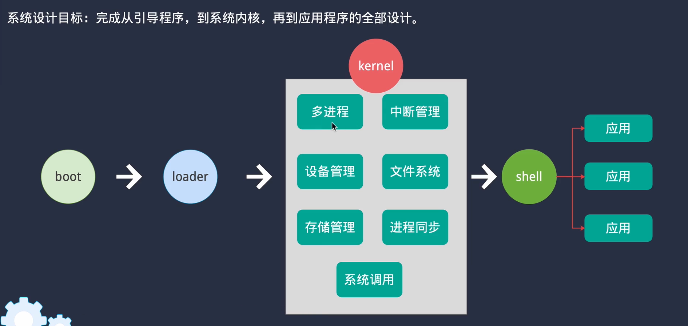
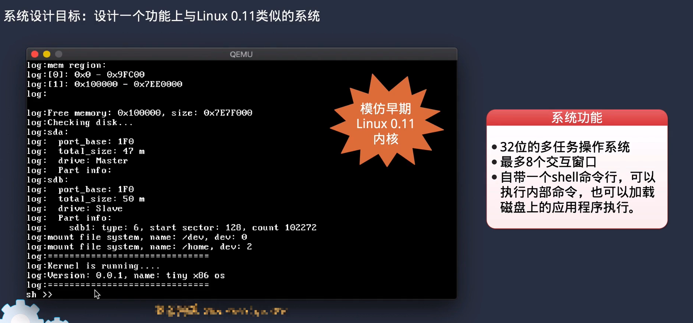

# 从 0 开始手写 x86 Linux 操作系统 👨‍💻💻

> “万物皆文件，唯有内存最真实。” —— 一个正在手搓内核的C++程序员

## 🧠 项目简介

这个仓库是我跟着 **李述铜老师** 的课程《**从0开始手写x86 Linux操作系统**》边学边写的实战项目，试图重新认识“计算机到底是怎么动起来的”。

## 🚀 当前进度（持续更新中）

- [x] x86保护模式下的编程  
- [x] 引导程序：接管控制权
- [x] 加载器loader的实现
- [ ] 中断与异常处理
- [ ] 日志与printf格式化输出
- [ ] 实现简单的进程切换
- [ ] 实现链表数据结构
- [ ] 进程的管理与延时
- [ ] 进程间的同步与互斥
- [ ] 虚拟内存管理和保护模式
- [ ] ......

> 📌 总目标：写出一个可以跑在 qemu/bochs/真实硬件 上的 mini Linux 内核！

## 📸 项目预览

## 📚 学习资料

- 李述铜：[从0开始手写x86 Linux操作系统](https://www.yuque.com/lishutong-docs/x86os)
- 王柏生/王晟寒：[穿越操作系统迷雾 从零实现操作系统](https://book.douban.com/subject/36560814/)
- QEMU 模拟器：[https://www.qemu.org](https://www.qemu.org)
- Bochs 模拟器：[http://bochs.sourceforge.net](http://bochs.sourceforge.net)